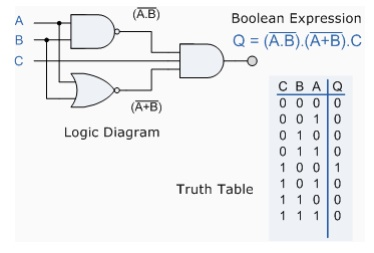
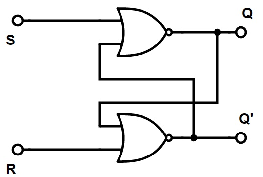

# How is SR Latch a *Sequential circuit*

Let us try to first understand, what actually is a sequential circuit. Basically, a circuit can be of two types 

* Combinational circuit
* Sequential circuit

## Combinational Circuits

A combinational circuit's outputs depend only on the current values of the input i.e it combines the current input values to compute the output values.

This is a combinational circuit as the output completely depends upon the input values.

## Sequential Circuits

A Sequential circuit's outputs depend on both current and previous values of inputs i.e it depends upon the input sequence.

Let's study the most common and easy sequential circuit called SR Latch and observe how the outputs of sequential circuits are dependent upon its current and previous inputs.

## SR Latch

This circuit is called A SR Latch, it is one of the simplest sequential circuit consisting of two cross-coupled NOR gates. The latch has two inputs S and R and has two outputs Q and Q'. Let's try to figure out the four possible combinations of R and S. 

**Let the gate having  input R be named N1 and that having S be N2.**

* ### *case1 R=1 S=0* :

    Clearly when R is asserted the output of N1 will be 0 and that of N2 will be 1.

* ### *case2 R=0 S=1* :

    when S is asserted  N2 gives a 0 output and N1 gives 1

* ### *case3 R=1 S=1* :

    As both the inputs have at least one asserted input both gates give out a 0.

* ### *case2 R=0 S=0* :

    This is where the fun begins N1 receives inputs of 0 and Q'. Because we don't yet know Q', we cant determine the output. Now similarly N2 receives inputs of 0 and Q, But we don't know what Q is. Now we are stuck.

    But let's think a little deep we know that Q must be either 1 or 0. So let's try to observe the subcases:-

    (At the given point the value of Q can be either 1 or 0 considering both cases )

    * #### *case1 Q=0* :
        As Q is false the N2 gate receives both the inputs as 0 and hence spits out 1 

    * #### *case2 Q=1* :
         Now exactly inverse is happening i.e  N2 produces a false output and N1 receives two false inputs spitting out true output

Now at this point we can get the essence of what a sequential circuit is and how it is dependent on previous input, U might be thinking to wait a minute isn't it the same as a combinational circuit it all depends on S and R just the inputs, yes it until the very point when both S and R become false i.e 0, as we discussed above the value of Q must be either 0 or 1 there's no other possibility other than that, then **what exactly decides the value of Q ?** and the answer is the previous state of the system whether it was in (set) i.e S=1 R=0 or S=0 R=1(reset) state the system gets the previous value of Q that is being decided by the previous inputs and hence it is called a sequential circuit.

